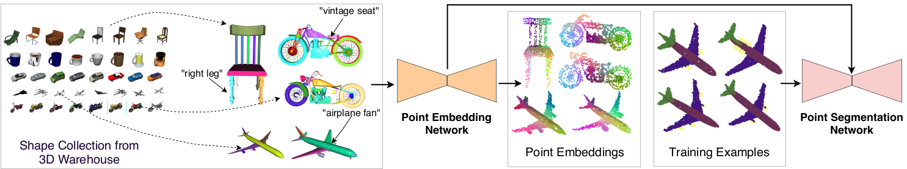

# Learning Point Embeddings from Shape Repositories for Few-shot Semantic Segmentation

[Gopal Sharma](https://hippogriff.github.io/), [Evangelos Kalogerakis](https://people.cs.umass.edu/~kalo/), [Subhransu Maji](https://people.cs.umass.edu/~smaji/)

***



*U*ser generated 3D shapes in online repositories contain rich information about*
  *surfaces, primitives, and their geometric relations, often arranged in a*
  *hierarchy. We present a framework for learning representations of 3D shapes*
  *that reflect the information present in this meta data and show that it leads*
  *to improved generalization for semantic segmentation tasks. Our approach is a*
  *point embedding network that generates a vectorial representation of the 3D*
  *points such that it reflects the grouping hierarchy and tag data. The main*
  *challenge is that the data is noisy and highly variable. To this end, we*
  *present a tree-aware metric-learning approach and demonstrate that such*
  *learned embeddings offer excellent transfer to semantic segmentation tasks,*
  *especially when training data is limited. Our approach reduces the relative*
  *error by 10.2 % with 8 training examples, by 11.72 % with 120 training*
  *examples on the ShapeNet semantic segmentation benchmark, in comparison to the*
  *network trained from scratch. By utilizing tag data the relative error is*
  *reduced by 12.8 % with 8 training examples, in comparison to the network*
  *trained from scratch. These improvements come at no additional labeling cost*
  as the meta data is freely available.* 

[Paper](https://people.cs.umass.edu/~smaji/papers/pen-3dv19.pdf)

### Cite:
```bibtex
@InProceedings{Sharma_3DV,
author = {Sharma, Gopal and Kalogerakis, Evangelos and Maji, Subhransu},
title = {Learning Point Embeddings from Shape Repositories for Few-shot Semantic Segmentation},
booktitle = {2019 International Conference on 3D Vision (3DV)},
month = {Sep},
year = {2019}
}
```
